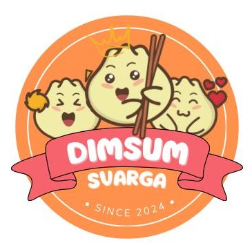

# 🍱 Svarga Dimsum | Digital Ordering Experience for Culinary Lovers

**Svarga Dimsum** bukan sekadar usaha kuliner. ini adalah pengalaman rasa yang dibungkus dalam teknologi. Kami percaya bahwa kelezatan dimsum harus semudah satu klik saja untuk sampai ke tangan pelanggan. Maka dari itu, lahirlah website interaktif ini.

Website ini dirancang untuk menjadi _digital front store_ bagi pelanggan: dari melihat menu, bermain game berhadiah voucher, hingga memesan langsung via WhatsApp. Semuanya dirancang dengan antarmuka yang ramah, animasi yang memikat, dan fitur-fitur kekinian yang siap meningkatkan engagement dan konversi penjualan.

Dengan sentuhan estetika modern dan pengalaman pengguna yang imersif, kami membawa cita rasa rumahan ke dalam bentuk digital yang bisa diakses siapa saja, di mana saja.

---

## ✨ Highlight Fitur

🔹 **🎮 Game Memory Berhadiah Voucher**  
Mainkan mini-game memory langsung di web dan dapatkan voucher unik untuk pembelian.

🔹 **🛒 Sistem Keranjang Dinamis + Checkout WA**  
Tambahkan menu ke keranjang dan checkout langsung via WhatsApp dengan data yang sudah diisi otomatis.

🔹 **💬 AI Chatbot Asisten Svarga**  
Bot virtual siap membantu pelanggan dalam memesan secara interaktif dengan UI bersahabat.

🔹 **📄 Form Order Canggih**  
Form pemesanan lengkap dengan pilihan level pedas, metode pembayaran, dan ringkasan total harga secara real-time.

🔹 **📍 Google Maps & Sosial Media Integration**  
Petunjuk lokasi, GoFood/ShopeeFood links, dan social media disatukan dalam satu halaman yang elegan.

---

## 💻 Teknologi yang Digunakan

| Teknologi | Fungsi |
|----------|--------|
| `HTML5`, `CSS3`, `JS` | Struktur dan logika interaktif |
| `GSAP` | Animasi scroll dan elemen |
| `Font Awesome`, `Iconify` | Ikon visual modern |
| `Google Fonts` | Tipografi yang konsisten dan elegan |
| `WhatsApp API` | Pemesanan instan via WA |
| `Google Maps Embed` | Penunjuk lokasi bisnis |
| `Audio Player` | Efek suara saat loading |
| `Custom JS Chatbot` | Asisten virtual tanpa backend |

---

##👨‍🍳 Tim Pengembang

| Nama Lengkap  	     | 
| -------------------------- | 
| Muhamad Zaqi Wiradinata    |
| Rizqan Ahmad Maulana	     | 
| Verdi Alifahsam 	     | 

---

## 📸 Tampilan Singkat

> 

Website ini tampil *mobile-first* dan responsif — dari layar HP sampai desktop, semuanya optimal.

---

## 💡 Catatan Developer

Website ini dibangun dengan pendekatan *static web* namun kaya fitur seperti aplikasi. Cocok dijadikan template landing page untuk UMKM lain yang ingin tampil modern, informatif, dan interaktif tanpa memerlukan backend kompleks.

---

**Dibuat dengan penuh rasa lapar dan cinta oleh tim LocalGrow.**

